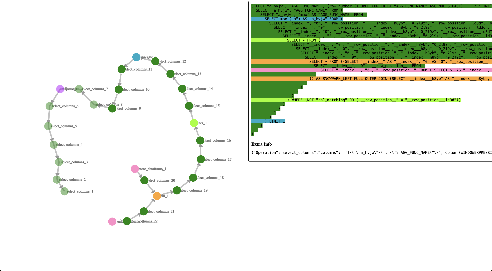

out of curiosity, i revived our old query visualization tool from ponder and made it work with snowpark dataframes. here's how it works for snowpark pandas.

i don't think we have a real use case for this tool yet among users or developers, but it's fun to see the visualizations.

we could also imagine visualizing the pandas API calls in a similar way by tracking lineage at the Snowpark pandas layer rather than at the Snowpark dataframe layer, e.g. a user could trace the pandas lineage of the snowpark pandas df as 1) read_sql 2) `getitem(['a', 'b'])` 3)  query('a==3') :

```python
df = pd.read_sql('CUSTOMER')
result = df[['a', 'b']]
result.query('a==3').debug_vis()
```

there are many ways to extend such a tool, e.g. each node can include a clickable stack trace to the code that caused that node to be added.

generally i think of a tool like this as a way to translate queries written imperatively into a form that makes the declarative structure clearer than a blob of unindented sql. this tool can be seen as a supplement to the logical plan visualization that snowflake already provides: https://docs.snowflake.com/en/user-guide/ui-query-profile

# Instructions


1. add extra dependencies. I think they are


    ```
    networkx
    pygraphviz
    colorcet
    ```

1. run a script like

    ```python
    import modin.pandas as pd
    import snowflake.snowpark.modin.plugin
    import numpy as np
    import pandas as native_pd
    from snowflake.snowpark.session import Session; session = Session.builder.create()
    import logging; logging.getLogger("snowflake.snowpark").setLevel(logging.DEBUG)

    pd.session.sql_simplifier_enabled = False


    (pd.DataFrame([1, 2]) + pd.DataFrame([3, 4])).rename({0: 'a'}, axis=1).max().debug_vis()
    ```

1. you can keep running python code after viewing the visualization.


1. when you want to do a new visualization, exit with control-c or `exit`, or close your terminal. don't exit with control-z as it sends SIGTSTP and i haven't figured out how to properly close the webserver when that happens.

1. if you accidentally control-z out and leave the process open, search of `lsof -i :3777` and kill the process on that port.

# Notes

1. to get prettier visualizations, set `pd.session.sql_simplifier_enabled = False` before generating your dataframe. The SQL simplifier often flattens recursive SQL queries.
1. some DataFrame methods don't have visualizations yet.
1. moving nodes is a little frustrating; they don't stay where i want them to.

# Examples



