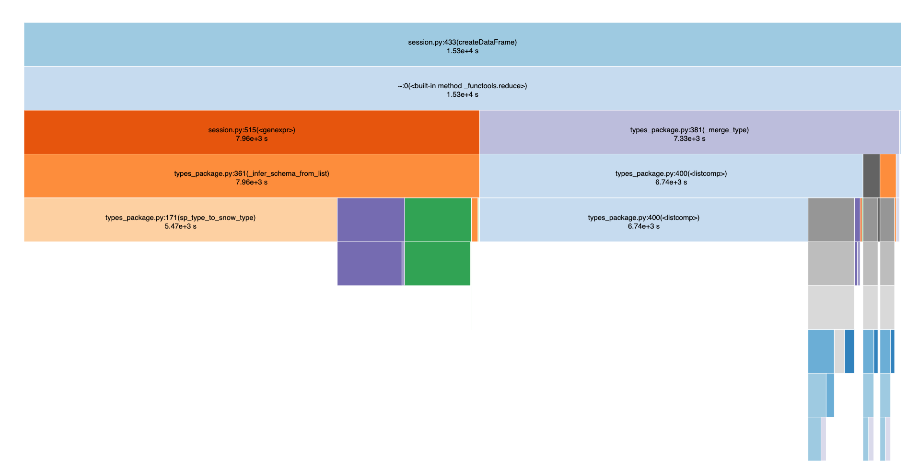

# Performance test of Session / DataFrame when dealing with large amounts of rows locally.

## Why test and what to test
Most of the time, snowpark-python client pushes down sql to SnowflakeDB so the client has no impact to performance. Yet
some APIs send data to, or receive data from SnowflakeDB, we need to understand their performance to properly give customers advice.
These methods need testing.
1. `Session.createDataFrame`
2. `Session.collect`
3. `Session.toPandas`
4. `DataFrameWriter.saveAsTable`
5. `DataFrameRead.csv`, `.parque`, `.orc`, `.avro`, `json`, `xml`.

## Test env
1. QA1 python_udf_test_account.qa1.int.snowflakecomputing.com
2. warehouse TEST_WH_SNOWPARK_PYTHON (xs)
3. Client side uses my MacBook Pro.
4. python-connector parameters use default value except the required params to connect to DB. python-connector has some parameters for better performance, we should try them later.

## Tools used
1. use cProfile to collect profile data in `*.prof` files.
```bash
python -m cProfile -o profile_data.prof test.py
```
2. use [SnakeViz](https://jiffyclub.github.io/snakeviz/) to view the profile data.
    - Install snakeviz
      ```bash
      pip install snakeviz
      ```
    - Use view profile data
      ```bash
      snakeviz profile_data.prof
      ```
3. Test scripts
   - collect_dataframe.py
   - create_dataframe_save_table.py
   - They accept command line arguments. Run `python collect_dataframe.py -h` to get help. For convenience,
     you can create `connection_parameters.py` to specify the following parameters and provide other parameters
     in the command line.
     ```python
     CONNECTION_PARAMETERS = {
        "host": "",
        "port": 8084,
        "account": "",
        "user": "",
        "warehouse": "",
        "database": "",
        "schema": "",
        "password": "",
        "protocol": "",
     }
     ```
## Test Results
### Create a dataframe from local data and save as table
Test program: `create_dataframe_save_table.py`

#### 200,000 rows * 10 cols
  Test case | Total Time (s) | Session.createDataFrame (s) | DataFrame.saveAsTable (s)
--- | --- | --- | ---
 infer schema | 57 | 40.5 | 14.2
 set schema | 23.5 | 2.96 | 17.4

#### 200,000 rows * 100 cols

  Test case | Total Time (s) | Session.createDataFrame (s) | DataFrame.saveAsTable (s)
--- | --- | --- | ---
 infer schema | 528 | 426 | 100
 set schema | 123 | 17.8 | 103

#### 200,000 rows * 1,000 cols
  Test case | Total Time (s) | Session.createDataFrame (s) | DataFrame.saveAsTable (s)
--- | --- | --- | ---
set schema | 1270 | 169 | 1090

The test with infer schema runs too long, so I killed the test after hours of running.
From profile data, `createDataFrame` was still working after 15,300 seconds.


#### 10,000 rows * 1,000 cols
  Test case | Total Time (s) | Session.createDataFrame (s) | DataFrame.saveAsTable (s)
--- | --- | --- | ---
infer schema | 344 | 276 | 66.3
set schema | 99 | 8.62 | 87.5

### Collect data to client
Load all rows from the table that is created in [cretate dataframe test](#create-a-dataframe-with-large-number-of-rows).
Test program: `collect_dataframe.py`

#### 200,000 rows * 10 cols
  Test case | Time (s)
--- | ---
 .collect() | 3.88
 .toPandas | 3.57

#### 200,000 rows * 1,000 cols
  Test case | Time (s)
--- | ---
 .collect() | 23.7 (run query 12.8, `Row.__new__` 6.78)
 .toPandas | 5.66

## Key findings
1. Generally, when data grows large, `Session.createDataFrame` is slow in uploading data to Snowflake DB. We need to find good alternative ways to the users, or fine tune the performance.
2. Infer-schema shouldn't be used on any large dataset. But it's cool for small dataset. It's worth looking into opportunities to improve when we have time.
3. Even with explicit schema, it takes 1000 seconds to upload 200,000 rows * 1000 columns to SnowflakeDB. python-connector may have parameters to boost this performance. Need to try later.
4. `DataFrame.toPandas()` is really fast. `.collect()` is several times slower for large dataset but it still not bad acceptable performance.
